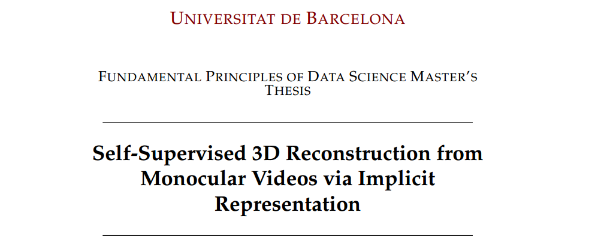
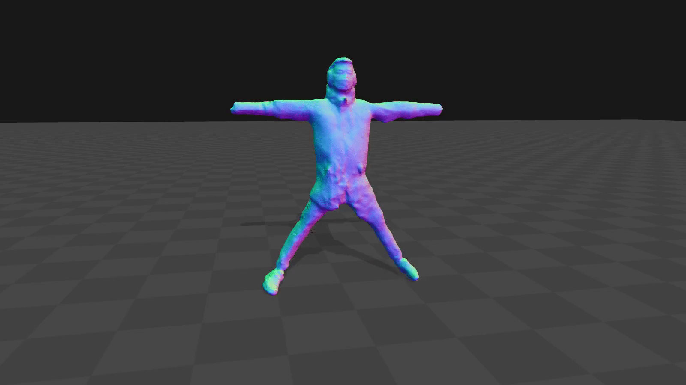
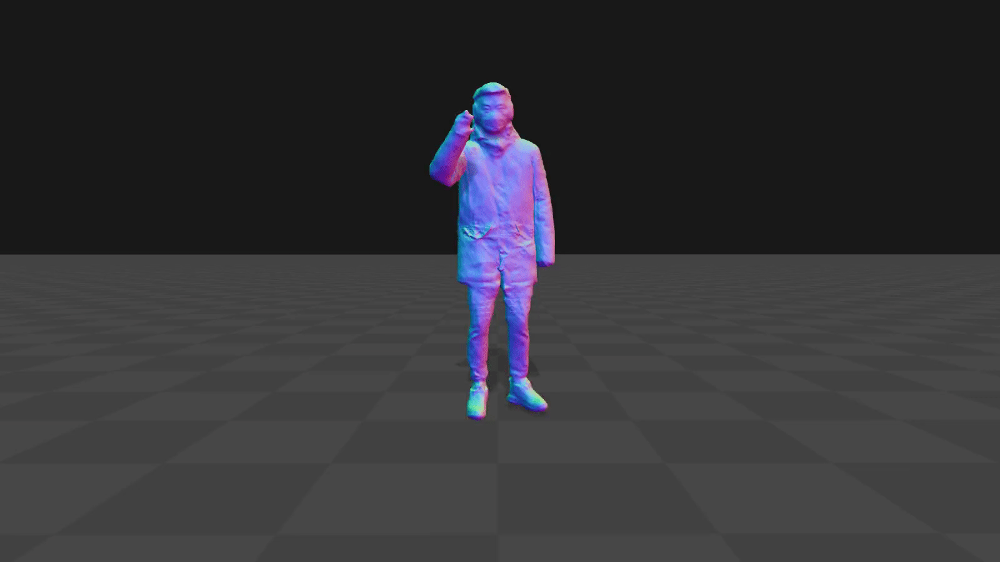

# AGen: Self-Supervised 3D Reconstruction from Monocular Videos via Implicit Representation


Official Repository for 'Self-Supervised 3D Reconstruction from Monocular Videos via Implicit Representation' Data Science master thesis

 

## Getting Started
* The work has been conducted using a docker image and container. The Dockerfile used is available in the main folder of the repo. The image needs to be run with: 
```
docker run -it --gpus all --name AGen -v /data-net/hupba/lbocchi:/AGen/data agen_image --rm -p 8763:8888 --name lb
```
* The dataset used needs to be included in the data folder following the structure included in the README found there, and attached through a volume to the container. 
* Download [SMPL model](https://smpl.is.tue.mpg.de/download.php) (1.0.0 for Python 2.7 (10 shape PCs)) and move them to the corresponding places:
```
mkdir code/lib/smpl/smpl_model/
mv /path/to/smpl/models/basicModel_f_lbs_10_207_0_v1.0.0.pkl code/lib/smpl/smpl_model/SMPL_FEMALE.pkl
mv /path/to/smpl/models/basicmodel_m_lbs_10_207_0_v1.0.0.pkl code/lib/smpl/smpl_model/SMPL_MALE.pkl
```
## Download preprocessed demo data
You can quickly start trying out Vid2Avatar with a preprocessed demo sequence including the pre-trained checkpoint. This can be downloaded from [Google drive](https://drive.google.com/drive/u/1/folders/1AUtKSmib7CvpWBCFO6mQ9spVrga_CTU4) which is originally a video clip provided by [NeuMan](https://github.com/apple/ml-neuman). Put this preprocessed demo data under the folder `data/` and put the folder `checkpoints` under `outputs/parkinglot/`.

## Training
To perform the training of the model it is only required to input the wanted parameters in the configuration files, under the folder 'confs', and run
```
cd AGen
python train.py
```
The training is logged using Weights&Biases, and the outputs can be found under the folder 'outputs' for both the validation on the training data during training, as well as the validation on the unseen validation set.
## Test
To reproduce the results it is sufficient to modify the path in the AGen_test.py script to point to a given model checkpoint, and run the script with 
```
cd code
python test.py
```
## 3D Visualization
We use [AITViewer](https://github.com/eth-ait/aitviewer) to visualize the human models in 3D. First install AITViewer: `pip install aitviewer imgui==1.4.1`, and then run the following command to visualize the canonical mesh (--mode static), deformed mesh sequence (--mode dynamic), or dynamic canonical surface (--mode dynamic_canonical_train):
```
cd visualization 
python vis.py --mode {MODE} --path {PATH}
```
<p align="center">
  
   
  
</p>

## Preprocess a video to include in the dataset
* We use [ROMP](https://github.com/Arthur151/ROMP#installation) to obtain initial SMPL shape and poses: `pip install --upgrade simple-romp`
* Install [OpenPose](https://github.com/CMU-Perceptual-Computing-Lab/openpose/blob/master/doc/installation/0_index.md) as well as the python bindings.
* Put the video frames under the folder `preprocessing/raw_data/{SEQUENCE_NAME}/frames`
* Modify the preprocessing script `preprocessing/run_preprocessing.sh` accordingly: the data source, sequence name, and the gender. The data source is by default "custom" which will estimate camera intrinsics. If the camera intrinsics are known, it's better if the true camera parameters can be given.
* Run preprocessing: `cd preprocessing` and `bash run_preprocessing.sh`. The processed data will be stored in `data/`. The intermediate outputs of the preprocessing can be found at `preprocessing/raw_data/{SEQUENCE_NAME}/`
* Launch training and test in the same way as above. The `metainfo` in the data config file `/AGen/data/3DPW_x_AGen/data/train/{SEQUENCE_NAME}/confs/video_metainfo.yaml` should be changed according to the custom video.

## Acknowledgement
We have used codes from other great research work, in particular [Vid2Avatar](https://github.com/MoyGcc/vid2avatar) for the video reconstruction module baseline.